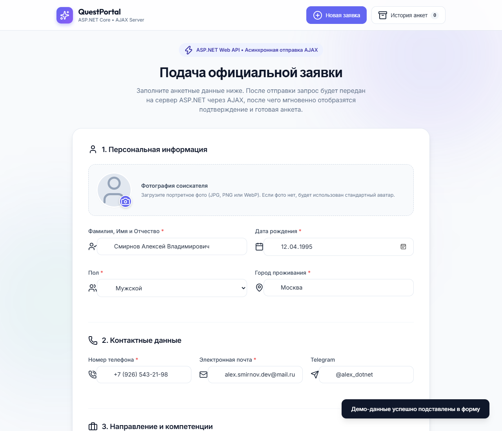
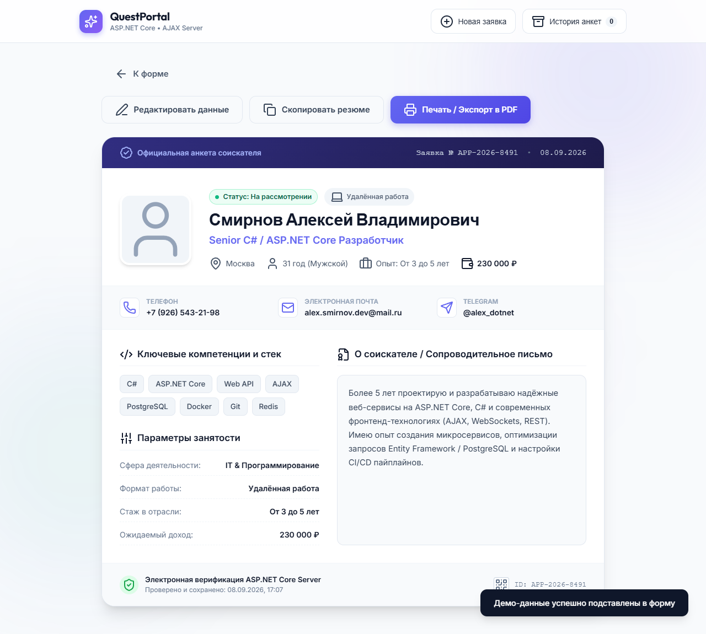

# Веб-приложение: Подача заявки и формирование анкеты человека

Современное полнофункциональное веб-приложение, разработанное на стеке **ASP.NET Core 8.0** и **AJAX (Асинхронный JavaScript и JSON)**.

---

## 📸 Скриншоты и пример работы

### 1. Форма подачи заявки соискателя
> Поля для ввода персональных данных, контактов, компетенций, тегов навыков, фото и сопроводительного текста. Поддерживается валидация в реальном времени и автозаполнение демо-данными.



---

### 2. Экран успешного заполнения (AJAX-подтверждение)
> После асинхронной отправки через AJAX сервер ASP.NET регистрирует заявку, генерирует уникальный регистрационный ID, вычисляет возраст и возвращает статус с анимацией салюта (конфетти).


---

### 3. Сформированная официальная анкета человека
> Презентабельная карточка-резюме соискателя со всеми данными, кликабельными контактами, параметрами занятости, автобиографией и возможностью **печати / экспорта в PDF**.



---

## 🚀 Возможности приложения

1. **Форма подачи заявки**:
   - Персональные данные: ФИО, дата рождения, автоматический расчёт возраста сервером, пол, город проживания.
   - Контакты: телефон с автоматической маской ввода, email, Telegram.
   - Профиль соискателя: сфера деятельности, желаемая должность, стаж, формат занятости, ожидания по зарплате.
   - Интерактивные теги ключевых навыков (добавление через Enter/запятую, быстрое удаление).
   - Загрузка и моментальный предпросмотр фотографии соискателя.
   - Раздел «О себе» / Сопроводительный текст.
   - Кнопка **«Заполнить демо-данными»** для быстрой проверки функционала в 1 клик.

2. **Асинхронная отправка (AJAX)**:
   - Форма отправляется на сервер ASP.NET без перезагрузки страницы через `fetch` API.
   - Отображается спиннер процесса загрузки.
   - При ошибках валидации сервер возвращает ошибки (HTTP 400 Bad Request), которые подсвечиваются под соответствующими полями формы.

3. **Экран подтверждения (Успешное заполнение)**:
   - Анимированный статус принятия заявки с праздничным салютом (эффект конфетти).
   - Сформированный уникальный регистрационный номер заявки (`#APP-2026-XXXX`).
   - Точное серверное время приёма и статус «На рассмотрении».

4. **Официальная анкета соискателя**:
   - Презентабельная карточка профиля (визитка/резюме).
   - Прямые кликабельные контакты (быстрый звонок `tel:`, письмо `mailto:`, переход в Telegram).
   - Блоки компетенций, параметров занятости и развёрнутой автобиографии.
   - Печать и сохранение в **PDF** (`window.print` с оптимизированными стилями под лист А4).
   - Возможность копирования анкеты в буфер обмена в структурированном виде.
   - Редактирование заявки или подача новой.

5. **История заявок**:
   - Хранение всех поданных заявок на сервере в `App_Data/applications.json`.
   - Модальное окно истории с возможностью просмотра любой ранее отправленной анкеты и удаления записей.

---

## 🏗 Архитектура проекта

```
Веб приложение заявки/
├── Controllers/
│   └── ApplicationsController.cs    # REST API контроллер ASP.NET (POST, GET, DELETE)
├── Models/
│   └── ApplicationSubmission.cs     # C# модель заявки с валидацией DataAnnotations
├── Services/
│   └── ApplicationStorageService.cs # Потокобезопасный сервис сохранения заявок
├── wwwroot/                         # Клиентская статика
│   ├── index.html                   # Разметка интерфейса (3 экрана SPA)
│   ├── style.css                    # Стилистика, анимации, печать для PDF
│   └── app.js                       # AJAX-логика, валидация, работа с сервером
├── screenshots/                     # Скриншоты работы приложения
│   ├── 01_form.png
│   ├── 02_success.png
│   └── 03_profile.png
├── App_Data/                        # Хранилище поданных заявок (JSON)
├── Properties/                      # Профили запуска (launchSettings.json)
├── Program.cs                       # Точка входа ASP.NET Core
├── start.bat                        # Запуск приложения в 1 клик
├── .gitignore                       # Исключение временных файлов
└── README.md                        # Документация проекта
```

---

## ⚡ Быстрый запуск

### Способ 1 (Самый простой):
Дважды нажмите на файл **`start.bat`**.  
Скрипт автоматически запустит сервер ASP.NET Core и откроет браузер по адресу:  
**http://localhost:5000**

### Способ 2 (Через терминал):
```bash
dotnet run
```
После запуска откройте в браузере: `http://localhost:5000`
